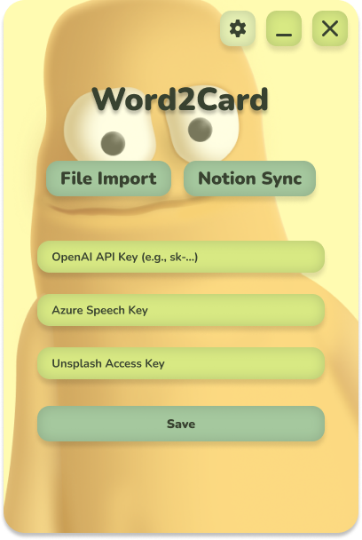
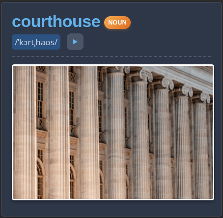
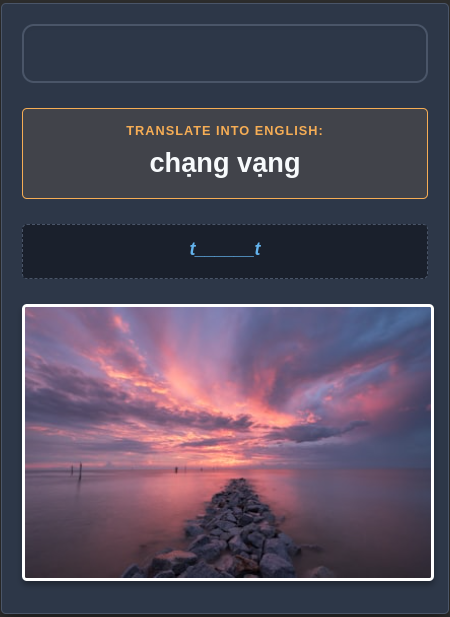
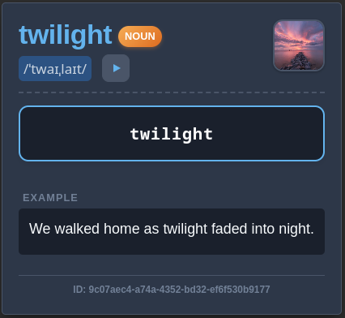

# Word2Card

This is an Electron-based desktop application that automates the creation of high-quality Anki flashcards. Whether you have a list of words in a text file or a database in Notion, Word2Card uses the power of AI to generate rich content, syncs it to Anki, and even updates your Notion database status.

|                 Home / File Import                  |                  Notion Sync Setup                  |               Settings (API Keys)               |
| :-------------------------------------------------: | :-------------------------------------------------: | :---------------------------------------------: |
|  |  |  |

## Key Features

- **Flexible Input:** Import words via a simple `.txt` file or sync directly from a **Notion Database**.
- **AI-Powered Content:**
  - **OpenAI:** Automatically generates definitions, translations, examples, and IPA transcriptions.
  - **Azure Speech:** Generates high-quality, natural-sounding audio pronunciations.
  - **Pexels:** Fetches relevant, high-quality images to visualize the vocabulary.

- **Seamless Anki Integration:** Pushes cards directly to Anki via AnkiConnect.
- **Notion Sync-Back:** Automatically updates your Notion rows (e.g., marks them as "Done") after the card is successfully created.

## Prerequisites

Before using the app, make sure you have the following ready:

1. **Anki Desktop:** Must be installed and **RUNNING** while using Word2Card.
2. **AnkiConnect Extension:** This is required for the app to communicate with Anki.
    - Download here: [AnkiConnect (Code: 2055492159)](https://ankiweb.net/shared/info/2055492159)
    - _Note: Restart Anki after installation._

3. **API Keys:** You need to provide your own keys in the Settings menu:
    - `OpenAI API Key` (for content generation).
    - `Azure Speech API Key` & `Region` (for audio).
    - `Pexels API Key` (for images).

_(Go to Settings, enter your keys, and hit "Save Keys")_

## Installation & Usage

1. Go to the **[Releases](https://www.google.com/search?q=link-to-your-github-releases&authuser=1)** page of this repository.
2. Download the installer for your OS (Windows, or Linux).
3. Install and launch the application.
4. Open **Settings** (gear icon) and configure your API keys.
5. **Start Creating Cards:**
    - **File Import:** Upload a `.txt` file (one word per line), choose a Deck name, and click Submit.
    - **Notion Sync:** Enter your Notion details to fetch words directly (see guide below).

## Notion Setup Guide

To use the Notion Sync feature effectively, please follow these steps:

1. **Duplicate the Template:**
    - I've prepared a Notion template compatible with this app. Duplicate it to your workspace: [Vocabulary Book](https://ym19.notion.site/2f08dbf4be72815ab996d6cb491ef10b?v=2f08dbf4be7281c08c71000c404fb391)

2. **Create an Integration:**
    - Go to [Notion My Integrations](https://www.notion.so/my-integrations).
    - Create a new integration (e.g., named "Word2Card").
    - Copy the **Internal Integration Token** (starts with `secret_...`).

3. **Connect Database:**
    - Open your duplicated database page.
    - Click `...` (top right) -> `Connections` -> Add your new Integration.

4. **Get Database ID:**
    - Open the database as a full page.
    - The ID is the string of characters in the URL between `notion.so/` and `?`.

5. **Sync:**
    - Paste the Token and Database ID into the app's Notion Sync tab.

## Result

|                 Review(Front)                  |                   Review(Back)                   |                 Typing(Front)                  | Typing(Back)                                     |
| :--------------------------------------------: | :----------------------------------------------: | :--------------------------------------------: | ------------------------------------------------ |
|  |  |  |  |

## Notes

- This app uses 3rd party APIs (OpenAI, Azure). Please be aware of your usage quotas and billing on those platforms.
- Pexels API has a rate limit (usually 20,000 requests per month), so take it easy!

## For Developers

If you want to contribute or build the app from source, here is how to get started. The stack is **Electron + TypeScript**.

### Install

```bash
npm install
```

### Development

```bash
npm run dev
```

### Build

```bash
# For windows
$ npm run build:win

# For macOS
$ npm run build:mac

# For Linux
$ npm run build:linux
```
