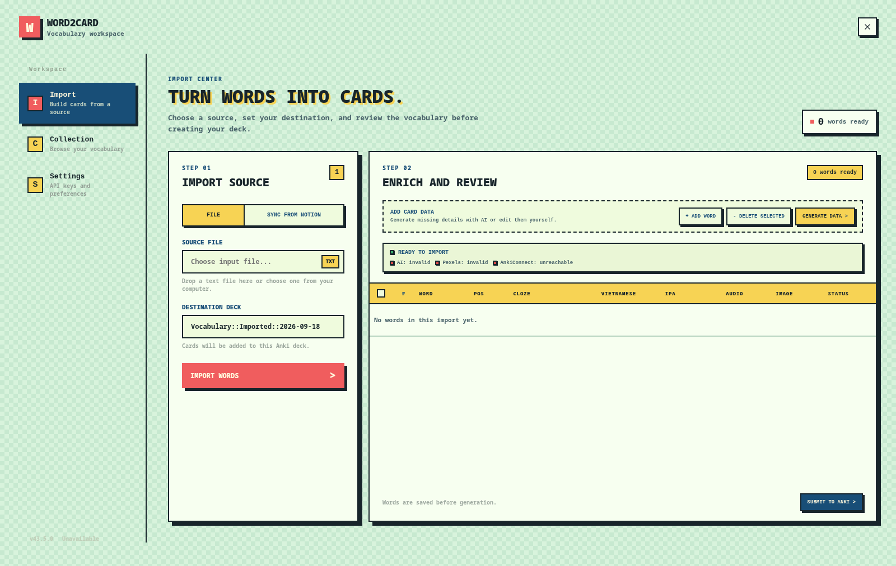
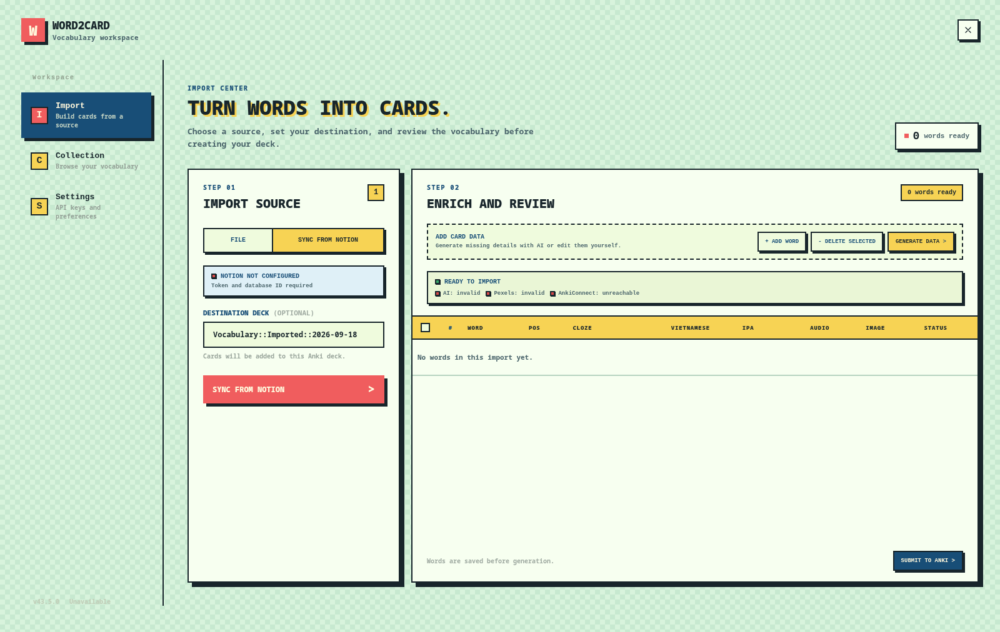
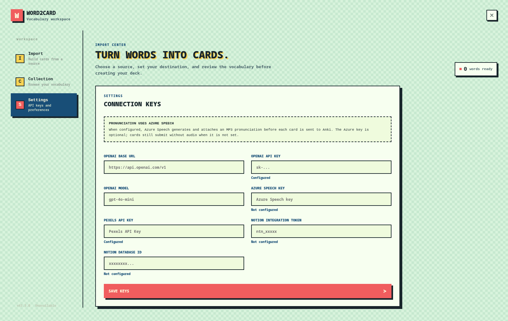
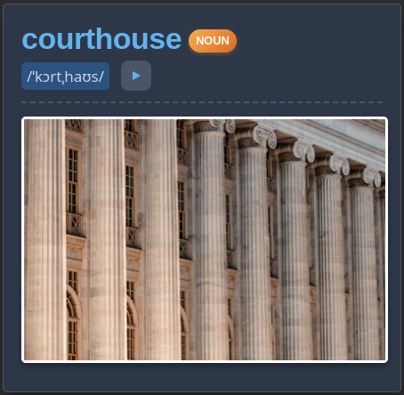
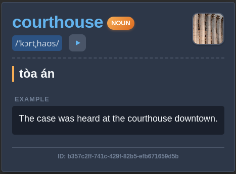
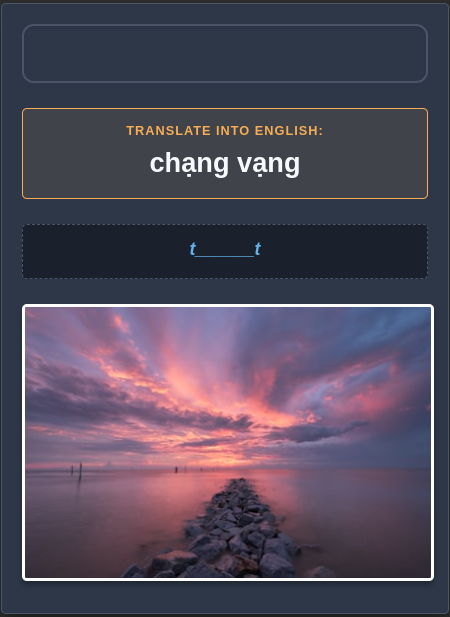
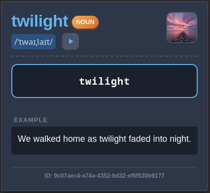

<p align="center">
  
</p>

<h1 align="center">Word2Card</h1>

<p align="center">
  Turn English vocabulary into ready-to-review Anki flashcards.<br>
  Import from files or Notion, enrich with AI, and sync directly to Anki.
</p>

<hr>

<p align="center">
  <a href="#features">Features</a> ·
  <a href="#setup">Setup</a> ·
  <a href="#usage">Usage</a> ·
  <a href="https://github.com/marcomoi395/word2card/releases">Download</a>
</p>

<p align="center">
  <a href="https://github.com/marcomoi395/word2card/releases">
    
  </a>
  <a href="./LICENSE">
    
  </a>
</p>

## Application preview

| Import workspace | Notion Sync | Settings |
| :---: | :---: | :---: |
|  |  |  |

## Features

- Import words from a `.txt` file or a Notion database.
- Generate part of speech, Vietnamese meaning, IPA, examples, and image queries with OpenAI.
- Optionally attach images from Pexels.
- Create and submit cards directly to Anki.
- Generate Azure Speech MP3 pronunciations and attach them to Anki cards.
- Mark synced Notion pages after cards are submitted.

## Requirements

1. **Anki Desktop** must be installed and running.
2. **AnkiConnect** must be installed and enabled in Anki. Use shared add-on code `2055492159`, then restart Anki.
3. An **OpenAI API key** is required for card content generation.
4. A **Pexels API key** is optional and only needed for images.
5. An **Azure Speech key** is optional for pronunciation audio. When configured, the Speech resource must use the `southeastasia` region.
6. Notion credentials are optional and only needed for Notion Sync.

## Pronunciation and platform support

After image lookup, Word2Card optionally creates an MP3 with Azure Speech (`en-US-JennyNeural`) and attaches it to the Anki note. The resulting media syncs with the card, so playback does not depend on the operating system's TTS voice or an Anki TTS add-on. Without an Azure Speech key, cards are submitted without audio.

Word2Card creates the note type `AnkiVNModel_Flashcard`. Existing note types and cards are not overwritten, so the first sync after upgrading may create this note type.

## Setup

1. Start Anki and confirm that AnkiConnect is available.
2. Start Word2Card and open **Settings**.
3. Enter the OpenAI API key. Add Pexels or Notion credentials only if you use those features.
4. Save the settings and check the provider status indicators.

## Usage

### File import

1. Prepare a UTF-8 text file with one English word per line.
2. Open **File Import**, choose the file and an Anki deck, and submit it.
3. Review the generated rows and submit the ready cards to Anki.

### Notion Sync

1. Duplicate the [Vocabulary Book template](https://ym19.notion.site/2f08dbf4be72815ab996d6cb491ef10b?v=2f08dbf4be7281c08c71000c404fb391).
2. Create a Notion integration at [Notion My Integrations](https://www.notion.so/my-integrations).
3. Share the database with that integration and copy the database ID from its URL.
4. Enter the token, database ID, and target deck in **Notion Sync**.

## Result

The generated flashcards are added to Anki with review and typing cards:

| Review (Front) | Review (Back) | Typing (Front) | Typing (Back) |
| :---: | :---: | :---: | :---: |
|  |  |  |  |

## Development

```bash
bun install
bun run dev
```

Run checks:

```bash
bun run test
bun run typecheck
bun run build
```

Build installers:

```bash
bun run build:win
bun run build:mac
bun run build:linux
```

### Arch Linux (x86_64)

Starting with the next configured release, versions are published to the AUR as `word2card-bin`:

```bash
yay -S word2card-bin
```

The package downloads the versioned AppImage from the GitHub Release and verifies its SHA-256 checksum. Each release updates the AUR package automatically. Maintainers can find the one-time AUR setup in [`.github/AUR.md`](.github/AUR.md).

## Privacy and costs

Word2Card sends imported words to the configured OpenAI-compatible endpoint for content generation and Azure Speech for MP3 pronunciation generation. Pexels and Notion are contacted only when those features are used. Azure Speech usage may incur provider charges.

## License

See [LICENSE](LICENSE).
